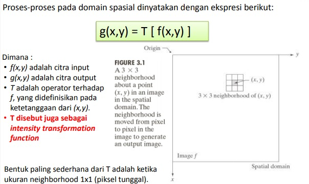
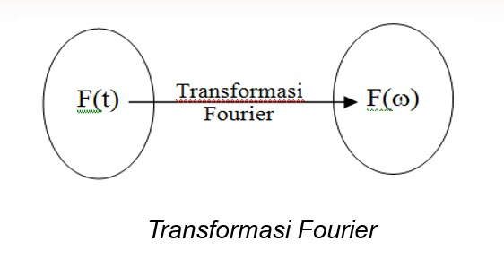
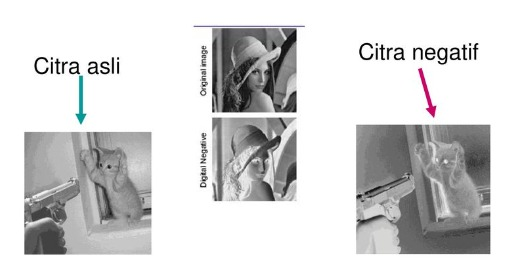
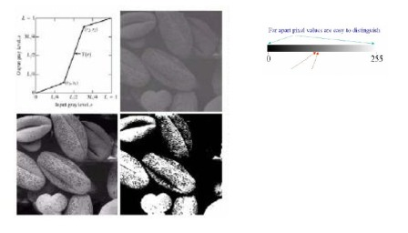
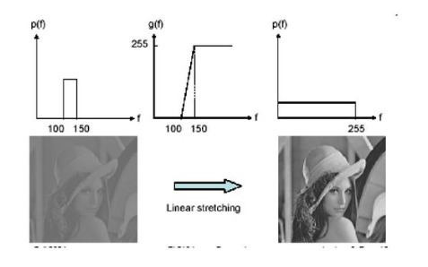
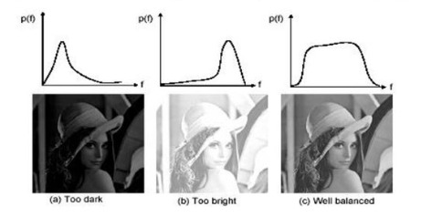
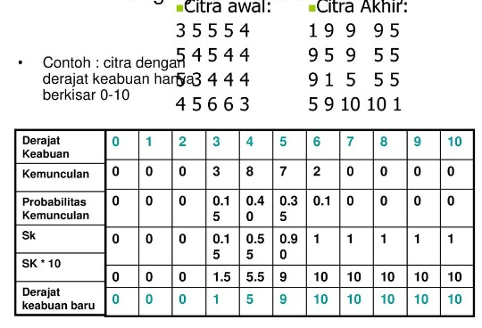
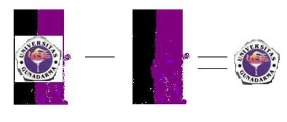
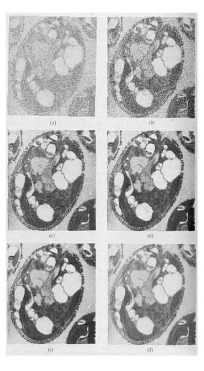
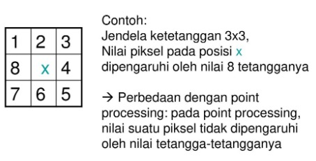

Nama : Maysarah 
NIM : 2110131120006  

<h1 align="center">METODE SPASIAL DAN FREKUENSI DOMAIN</h1>  

Teknik peningkatan mutu/kualitas citra dapat dibagi menjadi dua yaitu:
<ol>
<li>Peningkatan mutu citra pada domain spasial</li>
<li>Peningkatan mutu citra pada domain frekuensi</li></ol>
 

**Domain Spasial**

Adalah proses manipulasi kumpulan piksel dari sebuah citra secara langsung untuk menghasilkan citra baru.

 

**Domain Frekuensi**

Adalah teknik pemrosesan yang didasarkan pada
manipulasi terhadap transformasi Fourier dari suatu citra. 
Tranformasi Fourier merupakan suatu proses untuk mengubah domain spasial menjadi domain frekuensi.

 

## **METODE SPASIAL DOMAIN**

Peningkatan mutu citra pada domain spesial terbagi menjadi dua yaitu Point Processing dan Mask Processing.

**1. Point Processing**

Cara paling mudah untuk peningkatan mutu pada domain spasial adalah dengan melakukan pemrosesan yang hanya melibatkan satu piksel saja, tanpa menggunakan jendela ketetanggaan. 

- Citra Negatif 
Mengubah nilai grey-level piksel citra input dengan:

    Gbaru = 255 - Glama  
Hasilnya seperti klise foto  
  

- Contrast Streching 
Mengubah kontras dari suatu image dengan cara mengubah greylevel piksel-piksel pada citra menurut fungsi s = T(r) tertentu

    r1 <= r2, s1 <= s2 
    r1 = r2, s1 = s2 --> tidak ada perubahan 
    r1 = r2, s1 = 0, s2 = 255 --> tresholding menjadi citra biner dengan ambang r1  
 
  

- Histogram Equalization 
Histogram processing : mengubah bentuk histogram agar pemerataan gray level pada citra juga berubah 
 
  

- Image Substraction 
Dilakukan jika ingin mengambil bagian tertentu dari citra. 
  

- Image Averaging 
Dilakukan jika ada beberapa citra yang bergambar sama, namun semua citra memiliki noise (gangguan) dan noisenya berbeda satu sama lain (tidak berkorelasi). Cara memperbaikinya adalah dengan melakukan operasi rata-rata terhadap semua citra tersebut.  
  

**2. Mask Processing**

 Melakukan operasi terhadap suatu jendela ketetanggaan pada citra. Lalu menerapkan suatu <i>mask</i> terhadap jendela tersebut. <i>Mask</i> sering juga disebut <i>filter.</i>  
  

