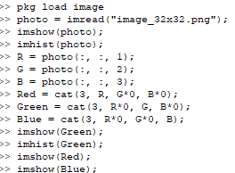
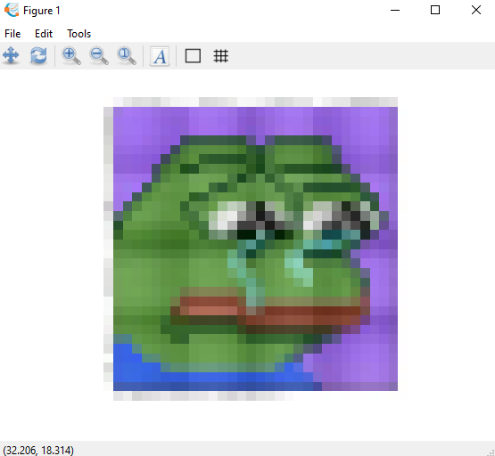
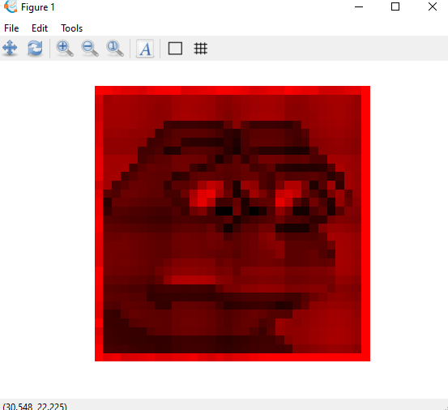
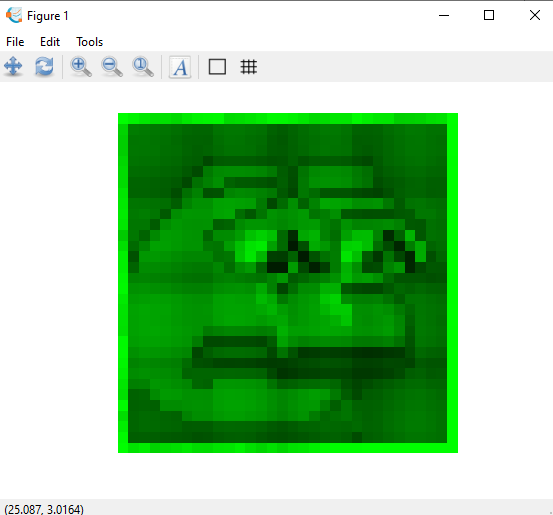
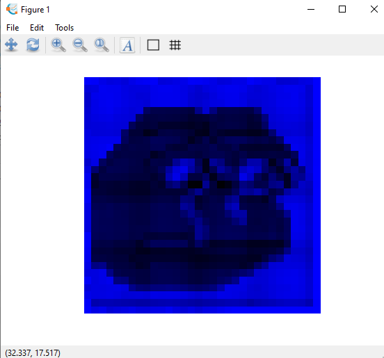
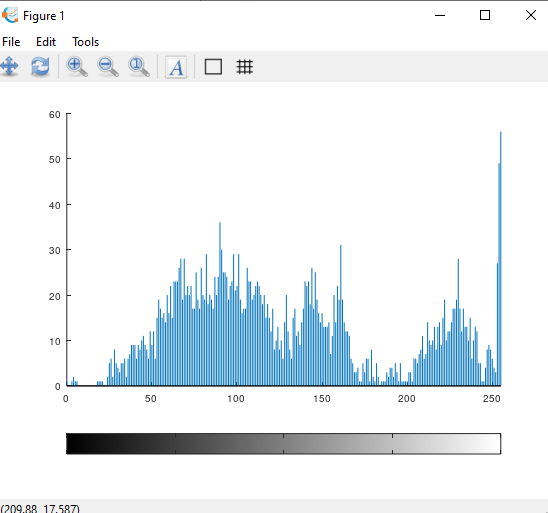

Nama : Maysarah 
NIM : 2110131120006  

<h1 align="center"><b>TUGAS 2 PCD</b></h1> 

1. Gambar berwarna 32x32 

 

 

2. Eksplorasi gambar

Terdapat 3 layer dalam gambar berwarna. Masing-masing kanal warna memiliki nilai intensitas piksel dengan kedalaman bit sebesar 8-bit yang artinya memiliki variasi warna sebanyak 2^8 derajat warna (0 s.d 255). 
Pada kanal merah, warna merah sempurna direpresentasikan dengan nilai 255 dan hitam sempurna dengan nilai 0. Pada kanal hijau, warna hijau sempurna direpresentasikan dengan nilai 255 dan hitam sempurna dengan nilai 0. Begitu juga pada kanal biru, warna biru sempurna direpresentasikan dengan nilai 255 dan hitam sempurna dengan nilai 0.

Perintah yang digunakan untuk merepresentasikan citra RGB beserta masing-masing kanal warna nya yaitu:

 

Citra RGB yang diperoleh ditunjukkan pada Gambar dibawah ini.

 

Sedangkan representasi kanal warna R, G, dan B berturut-turut ditunjukkan pada Gambar 1, 2, dan 3.

 Gambar 1
 

 Gambar 2
 

 Gambar 3
 

**Fungsi imread**

imread adalah fungsi untuk membaca file image itu berada.

 

 

**Fungsi imshow**

imshow adalah fungsi untuk menampilkan gambar.

 

 

**Fungsi imhist**

imhist adalah fungsi untuk menampilkan image dengan bentuk histogram.

 

 
