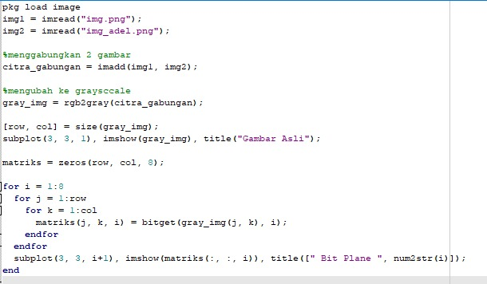

Nama : Maysarah 
NIM : 2110131120006  

<h1 align="center">TUGAS BIT PLANE SLICING</h1>  

**1. Eksperimen Pertama**

 Gambar Asli
 

 Kode Program
 

Metode untuk bit-plane slicing pada citra grayscale dapat menggunakan fungsi <b>bitget()</b>.
 

 Uraian Bit-Plane Slicing
  

**2. Eksperimen Kedua**

 Gambar Saya
 

 Gambar Teman
 

Disini gabungkan kedua gambar kemudian ubah ke dalam citra grayscale, setelah itu uraikan bit-plane slicingnya.
 

 Kode Program
 

 Uraian Bit-Plane Slicing
  

**3. Eksperimen Ketiga**

Menyisipkan pesan rahasia ke dalam gambar menggunakan teknik Steganografi.
 

 

 Kode Program
 

 Output
 

