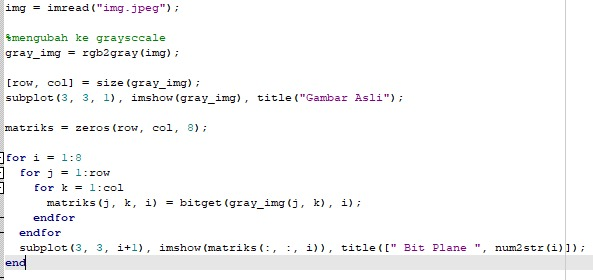

Nama : Maysarah 
NIM : 2110131120006  

<h1 align="center">TUGAS BIT PLANE SLICING</h1>  

**1. Eksperimen Pertama**

 Foto Asli
 

 Kode Program
 

Metode untuk bit-plane slicing pada citra grayscale dapat menggunakan fungsi <b>bitget</b>. Dengan menuliskan bitget(gray_img(x, y), 1) ini akan menampilkan bit-plane lapisan ke 1, untuk mencari lapisan lainnya cukup mengubah angka sesuai dengan lapisan yang diinginkan.
 

 Gambar Grayscale
 

 Bit-plane lapisan 1
 

 Bit-plane lapisan 2
 

 Bit-plane lapisan 3
 

 Bit-plane lapisan 4
 

 Bit-plane lapisan 5
 

 Bit-plane lapisan 6
 

 Bit-plane lapisan 7
 

 Bit-plane lapisan 8
 

