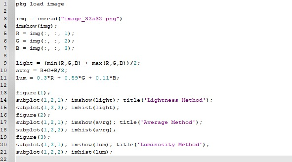
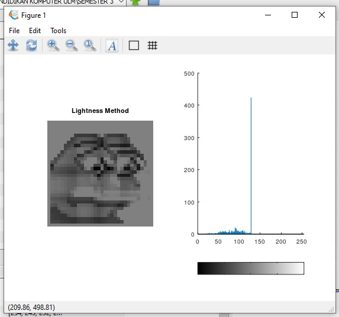
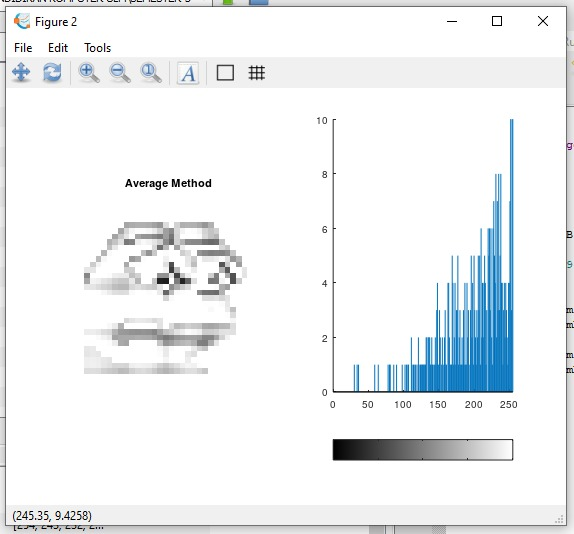
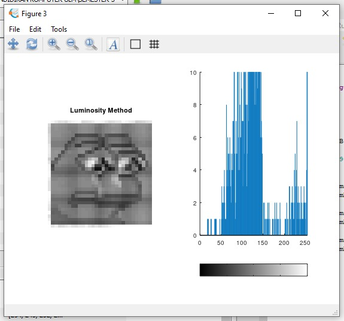

Nama: Maysarah 
NIM: 2110131120006  

# **GRAYSCALE**  

Untuk membuat gambar berwarna menjadi grayscale bisa menggunakan 3 metode, yaitu Lightness Method, Average Method dan Luminosity Method.

 

- simpan gambar dalam sebuah variabel.
- buat 3 variabel untuk masing-masing metode kemudian masukkan rumusnya.
- figure 1 menampilkan hasil dari Lightness Method.
- figure 2 menampilkan hasil dari Average Method.
- figure 3 menampilkan hasil dari Luminosity Method.

 

 

 