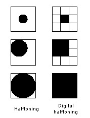
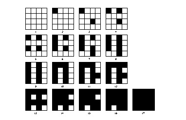
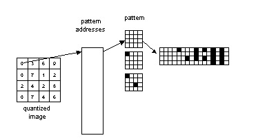
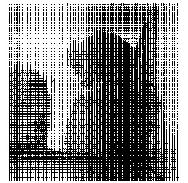
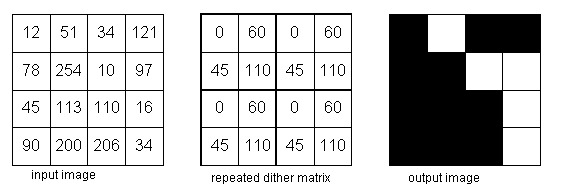

Nama: Maysarah 
NIM: 2110131120006  

<h1 align="center"><b>ULASAN TENTANG HALFTONING, PATTERNING DAN DITHERING</b></h1> 

<h3><b>Halftoning</b></h3>

Halftoning atau halftoning analog adalah proses yang mensimulasikan nuansa abu-abu dengan memvariasikan ukuran titik-titik hitam kecil yang diatur dalam pola yang teratur. Teknik ini digunakan dalam printer, serta industri penerbitan. Jika Anda memeriksa sebuah foto di koran, Anda akan melihat bahwa gambar itu terdiri dari titik-titik hitam meskipun tampaknya terdiri dari abu-abu. Hal ini dimungkinkan karena integrasi spasial yang dilakukan oleh mata kita. Mata kita memadukan detail halus dan merekam intensitas keseluruhan.
 

 Contoh Halftoning
 

Tiga metode umum untuk menghasilkan gambar halftoning digital adalah:
<ol>
<li>patterning</li>
<li>dithering</li>
<li>error diffusion</li>
</ol> 

<h3><b>Patterning</b></h3>

Patterning (Pola) adalah yang paling sederhana dari tiga teknik untuk menghasilkan gambar halftoning digital. Ini menghasilkan gambar yang memiliki resolusi spasial lebih tinggi daripada gambar sumber. Jumlah sel halftone citra keluaran sama dengan jumlah piksel citra sumber. Namun, setiap sel halftone dibagi lagi menjadi kotak 4x4. Setiap nilai piksel input diwakili oleh jumlah kotak terisi yang berbeda dalam sel halftone. Karena kisi 4x4 hanya dapat mewakili 17 tingkat intensitas yang berbeda, gambar sumber harus dikuantisasi. Gambar di bawah menunjukkan matriks pola rekursif Rylander.
 

 Matriks pola rekursif Rylander
 

 Operasi Patterning
 

Pattern menghasilkan gambar halftoning digital dari gambar input menggunakan teknik pola. Pola program membaca gambar input, mengkuantisasi nilai piksel, dan memetakan setiap piksel ke pola yang sesuai. Gambar yang dihasilkan 16 kali lebih besar dari aslinya. Gambar yang dihasilkan ditulis ke file output sebagai file TIFF. Sebuah kata peringatan: "pola" membutuhkan banyak perhitungan, gambar berukuran kurang dari 100x100 direkomendasikan.  Contoh ini menghasilkan gambar halftoning digital dari PAINTER menggunakan teknik pola
 

 Gambar halftoning digital PAINTER melalui pola
 

<h3><b>Dithering</b></h3>

Teknik lain yang digunakan untuk menghasilkan gambar halftoning digital adalah dithering. Tidak seperti pola, dithering membuat gambar keluaran dengan jumlah titik yang sama dengan jumlah piksel pada gambar sumber. Dithering dapat dianggap sebagai thresholding gambar sumber dengan matriks gentar. Matriks diletakkan berulang kali di atas gambar sumber. Dimanapun nilai piksel gambar lebih besar dari nilai dalam matriks, titik pada gambar output diisi. Gambar dibawah menunjukkan contoh operasi dithering.
 

 

